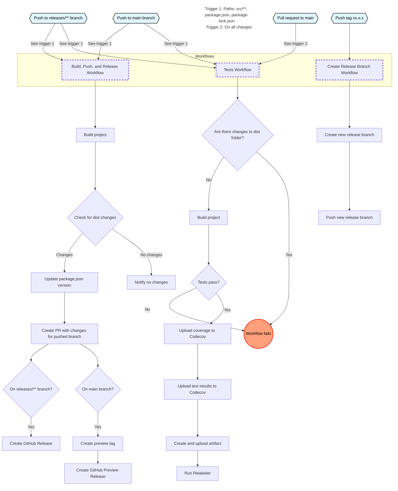

# Contribution Guidelines

Thank you for considering contributing to this project! Here are some guidelines to help you get started.

## How to Contribute

1. Fork the repository.
2. Create a new branch (`git checkout -b feature-branch`).
3. Make your changes.
4. Commit your changes (`git commit -m 'Add some feature'`).
5. Push to the branch (`git push origin feature-branch`).
6. Open a pull request.

## Code of Conduct

Please note that this project is released with a [Contributor Code of Conduct](CODE_OF_CONDUCT.md). By participating in this project you agree to abide by its terms.

## Reporting Issues

If you find a bug or have a feature request, please open an issue [here](https://github.com/your-repo/issues).

## Coding Standards

- Follow the existing code style.
- Write clear, concise commit messages.
- Add comments where necessary.

## Building, Testing, Packaging, and Releasing

### Building

The project uses TypeScript. To build the project, run:

```bash
npm run build
```

This will compile the TypeScript files in the `src` directory into JavaScript files in the `dist` directory.

## Testing

Please ensure that your changes pass all existing tests and add new tests for any new features.

### Running Tests

To run the tests, use the following command:

```bash
npm test:ci
```

This command will:

1. Clean the coverage directory
2. Run Jest tests with coverage and verbose output
3. Run the linter

If you want to run only the Jest tests without cleaning or linting, you can use:

```bash
npm test
```

or with debugging

```bash
npm test:debug
```

### Running Individual Tests

To run a specific test file, use:

```bash
npx jest path/to/your/test-file.test.ts
```

or

```bash
npm test -- path/to/your/test-file.test.ts
```

Replace `path/to/your/test-file.test.ts` with the actual path to the test file you want to run.

To run a specific test file without coverage, use the `--coverage=false`:

```bash
npm test -- --coverage=false path/to/your/test-file.test.ts
```

or

```bash
npx jest --coverage=false path/to/your/test-file.test.ts
```

To run a specific test or test suite within a file, use the `-t` flag followed by a name pattern:

```bash
npx jest path/to/your/test-file.test.ts -t "name of your test"
```

This will run only the tests whose names match the provided pattern.

### Linting

To run the linter separately:

```bash
npm run lint
```

To automatically fix linting issues:

```bash
npm run lint:fix
```

### Packaging

The `dist` directory contains the compiled JavaScript files. Ensure that this directory is up-to-date before committing your changes.

### Releasing

Releases are managed using GitHub Actions and GitVersion for semantic versioning.

#### Creating a Release

1. **Tagging a Release**: To create a new release, create a new tag on the `main` branch. For example:

   ```bash
   git tag v1.0.0
   git push origin v1.0.0
   ```

2. **Release Branch**: The `create-release-branch.yml` workflow will automatically create a new branch named `releases/v1.0.0` based on this tag.

3. **Building and Packaging**: The `build-and-push.yml` workflow will run on the new release branch, compile the project, update the `dist` folder, and create a GitHub release.

#### Semantic Versioning

The project uses GitVersion to manage semantic versioning. The version is determined based on the commit history and branch names.

- **Major Changes**: Include `breaking change` or `breaking` (case-insensitive) in your commit message.
- **Minor Changes**: Include `adds`, `add`, or `minor` (case-insensitive) in your commit message.
- **Patch Changes**: Include `fix` or `patch` (case-insensitive) in your commit message.
- **No Version Bump**: Include `+semver: none` or `+semver: skip` in your commit message.

<!-- cSpell:ignore hotfixes -->
Branch naming conventions also affect versioning:

- Feature branches (`feature/...` or `features/...`) increment the minor version.
- Hotfix branches (`fix/...`, `fixes/...`, `hotfix/...`, or `hotfixes/...`) increment the patch version.
- Release branches (`releases/...` or `release/...`) increment the patch version.

The main branch is labeled as 'preview' in the version.

## Workflows

This illustrates the GitHub Actions workflows in this repository.



## License

By contributing, you agree that your contributions will be licensed under the MIT License.
